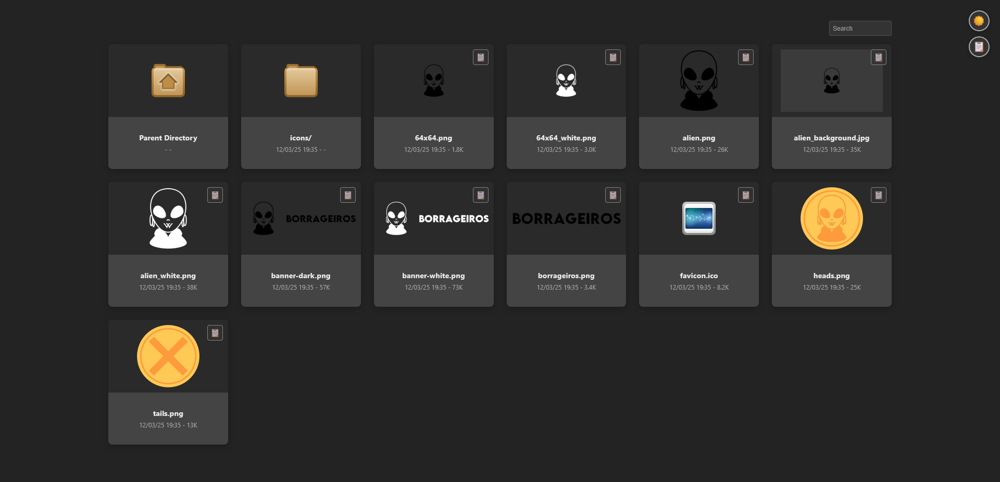
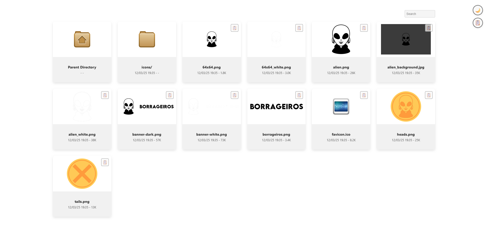

# 🖼️Apaxy Gallery Theme

A clean and modern theme for Apache directory listings, inspired by [oupala/apaxy](https://github.com/oupala/apaxy). This theme provides an elegant gallery-style interface with both light and dark modes.

## Features

- 🎨 Clean, modern gallery layout
- 🌓 Automatic dark/light mode based on system preferences
- 📋 Toggle between gallery and table views
- 🔄 Manual theme toggle
- 📱 Fully responsive design
- 🖼️ Modern Image/Video/Audio preview support
- 📂 Clear file/folder organization
- 📎 Quick copy file URL button

## 📷 Screenshots

### ⬛ Dark Mode


### ⬜ Light Mode  


### 🖼️ Image/Video/Audio preview


### 📋 [oupala/apaxy](https://github.com/oupala/apaxy) Table mode


## 🗒️ Installation

###  Standard Installation

1. Navigate to your Apache server's directory listing folder
2. Clone this repository:
```bash
git clone git@github.com:borrageiros/apaxy-gallery.git .
```
3. (Optional and Recommended) Remove this README, the Dockerfile and the LICENCE:
```bash
rm README.md && rm Dockerfile && rm LICENCE
```

### 🐳 Docker Installation

The image is available on Docker Hub with support for both AMD64 and ARM64 architectures.

#### Available Tags
- `borrageiros/apaxy-gallery:latest` - For AMD64/x86_64 systems
- `borrageiros/apaxy-gallery:arm64` - For ARM64/AArch64 systems

#### Quick Start
Run the container with your images directory mounted:

```bash
docker run -d \
  -p 80:80 \
  -v /path/to/your/images:/usr/local/apache2/htdocs/images \
  --name apaxy-gallery \
  borrageiros/apaxy-gallery
```

#### Mount your images directories
You can mount as many directories as you need by adding multiple `-v` flags. For example:

- `-v /path/to/your/images:/usr/local/apache2/htdocs/images`
- `-v /path/to/your/images2:/usr/local/apache2/htdocs/images2`
- `-v /path/to/your/photos:/usr/local/apache2/htdocs/photos`
- `-v /path/to/your/gallery:/usr/local/apache2/htdocs/gallery`

Each mounted directory will be accessible through its respective path in the gallery interface.

## ❗ Requirements

- Apache 2.4+
- mod_autoindex enabled
- AllowOverride Options Indexes FileInfo in your Apache configuration

Example Apache configuration:
```apache
<Directory /var/www/gallery>
        Options Indexes FollowSymlinks
        AllowOverride All
        Order allow,deny
        Allow from all
        Require all granted
</Directory>
```

## 🙏 Credits

This theme is inspired by and based on [oupala/apaxy](https://github.com/oupala/apaxy), a customizable theme for Apache directory listings.

## License

This program is free software: you can redistribute it and/or modify it under the terms of the GNU General Public License as published by the Free Software Foundation, either version 3 of the License, or (at your option) any later version.

This program is distributed in the hope that it will be useful, but WITHOUT ANY WARRANTY; without even the implied warranty of MERCHANTABILITY or FITNESS FOR A PARTICULAR PURPOSE. See the GNU General Public License for more details.

You should have received a copy of the GNU General Public License along with this program. If not, see http://www.gnu.org/licenses/.